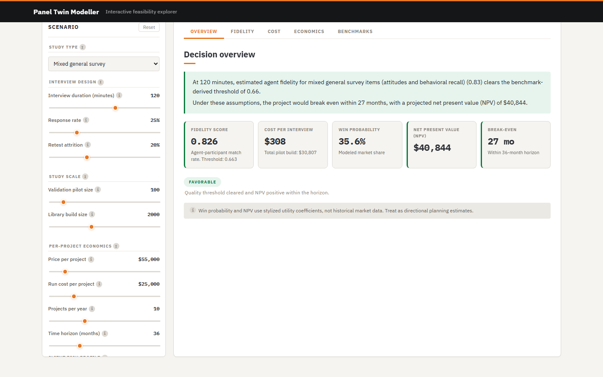

# Panel Twin Modeller

Digital panel twin simulator focused on pilot-first estimation and scale-up feasibility.

## Interactive Web App

**GitHub Pages:** https://arrudafranco.github.io/panel-twin-modeller/



The primary interface is a React app deployed via GitHub Pages. It includes:
- An executive landing page with static model insights
- Interactive scenario controls (e.g., interview duration, panel size, pricing, memory architecture)
- Fidelity curves by interview duration with uncertainty bands
- Cost breakdown waterfall chart
- NPV timeline and Monte Carlo simulation (500 iterations, client-side)
- Federal benchmark comparison

To run locally:

```bash
cd docs-app
npm install
npm run dev
```

## Inspiration and Scope

This project is directly inspired by Stanford HCI's `genagents` project and the paper
*Generative Agent Simulations of 1,000 People*.

It does not claim to reproduce that codebase or its exact empirical evaluation. Instead, it uses that work as:
- a conceptual anchor for interview-based generative agents
- a reference point for paper-backed quality anchors where explicitly noted
- a design precedent for memory and reflection-centered agent construction

This repository extends beyond that scope into:
- feasibility and cost modeling
- sampling and representativeness adjustments
- pilot calibration
- investment case analysis, pricing, NPV, and break-even modeling
- an interactive public-facing web app with visualizations and executive narrative

Key modeling features:
- Study-type presets (mixed general survey, behavioral recall, incentivized behavior) set quality expectations and uncertainty bands
- Memory architecture is configurable (full transcript, summary memory, hybrid) and affects both quality estimates and token costs
- Pilot calibration via the `calibrate` CLI command can update model parameters from observed field data

## Python CLI (reference implementation)

The `twin_econ/` package is a Python reference implementation of the model. The React app is the actively maintained interface; the Python CLI is preserved as a reference and for one command that has no browser equivalent.

**The one command worth keeping:** `calibrate` ingests a pilot study CSV and updates model parameters based on observed data (response rates, attrition, token counts, quality metrics). This will be useful when real pilot data exists.

```bash
twin-econ calibrate --pilot_csv pilot_logs/runA.csv --config configs/base.yaml --out outputs/calibrated_run/
twin-econ calibrate --pilot_csv pilot_logs/template_response_modes.csv --config configs/attitude_profile.yaml --out outputs/calibrated_modes/
```

Other CLI commands (`run`, `sweep`, `mc`, `compare`, `benchmark`) are covered by the interactive React app. The Python model defaults in `twin_econ/params.py` and `configs/` reflect an earlier version of the model and may differ from the React app's current defaults.

To install:

```bash
python -m pip install -e .
```

To run tests:

```bash
pytest -q
```

39 of 39 tests pass.

## AI Assistance

This project was developed with substantial assistance from Claude Code (Anthropic). AI contributions included code generation, refactoring, documentation drafting, test writing, and iterative debugging across the React app, TypeScript model, and Python backend.

The intellectual direction of the project is the author's own. This includes the research framing, the decision to model pilot-first feasibility, the three-phase cost structure, the construct-type quality anchors and their uncertainty bands, the study-type reframing rationale, parameter calibration choices, and all design decisions documented in [docs/design_decisions.md](docs/design_decisions.md). All AI-generated code and text was reviewed and approved by the author before being committed.

The underlying model draws on Park et al. (2024), *Generative Agent Simulations of 1,000 People* (Stanford HCI), and on AAPOR and federal retest reliability benchmarks. Those external sources are documented in [docs/external_reference_defaults.md](docs/external_reference_defaults.md).

## Notes

- Config files are real YAML and loaded with `PyYAML`.
- Python CLI study-type presets (for the `calibrate` command) are in `configs/attitude_profile.yaml`, `configs/self_report_profile.yaml`, and `configs/incentivized_profile.yaml`.
- A sample pilot CSV with optional response-mode calibration columns is available at `pilot_logs/template_response_modes.csv`.
- All RNG-driven paths are seeded.
- The Python model defaults (`twin_econ/params.py`, `configs/`) reflect an earlier calibration and may diverge from the React app's current defaults. See the Known Issues section in [docs/design_decisions.md](docs/design_decisions.md) before using the Python CLI for financial projections.
- Plain-English architecture and rationale are documented in [docs/design_decisions.md](docs/design_decisions.md).
- Optional external anchor references are documented in [docs/external_reference_defaults.md](docs/external_reference_defaults.md).

## Feedback

Bug reports, model critiques, and suggestions are welcome via [GitHub Issues](https://github.com/arrudafranco/panel-twin-modeller/issues). This includes model assumption challenges, UX friction, and parameter range requests.
